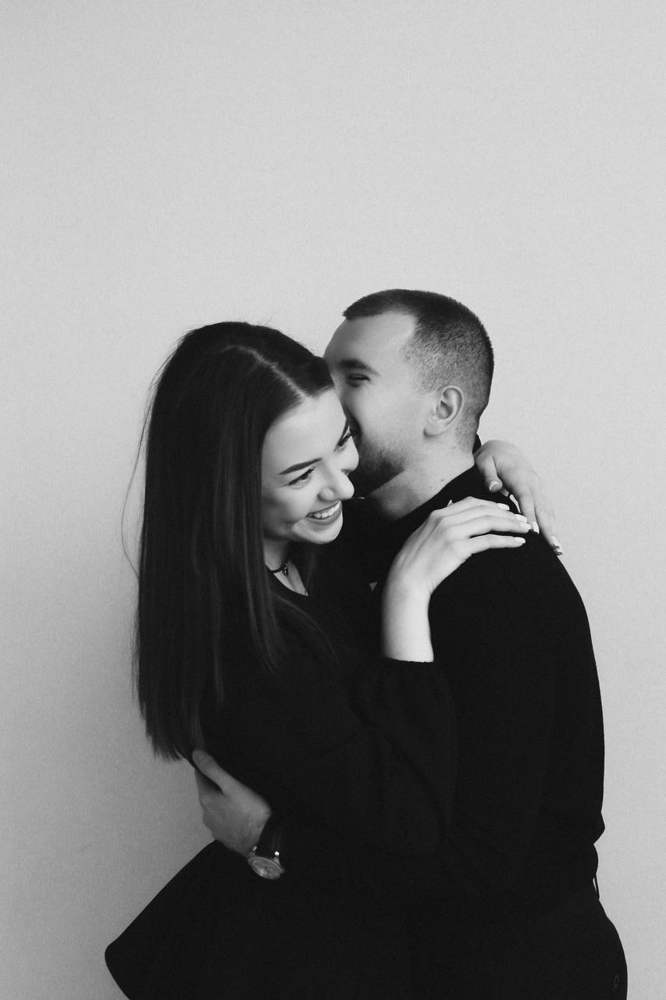
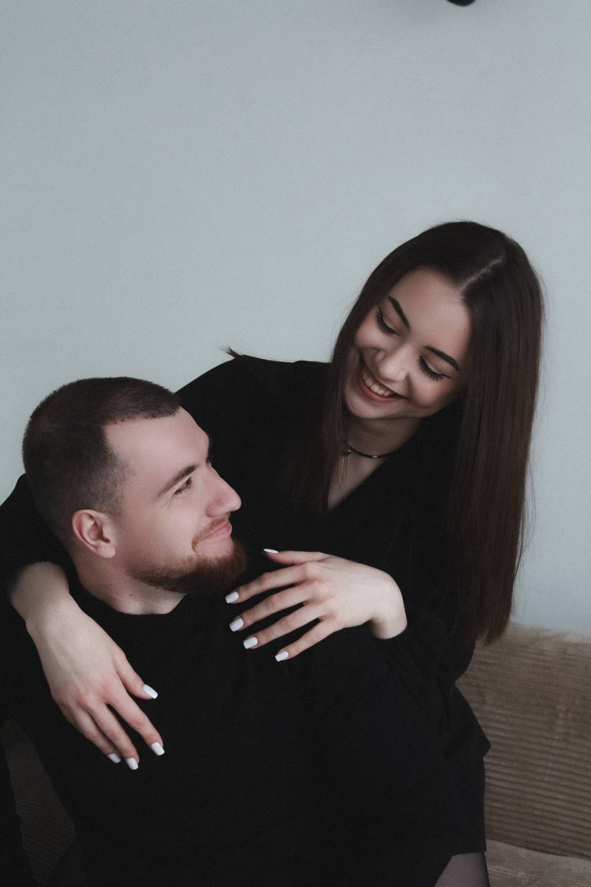

# For-Daria-
<!DOCTYPE html>
<html lang="ru">
<head>
<meta charset="UTF-8">
<meta name="viewport" content="width=device-width, initial-scale=1.0">

<title>Для Дарьи ❤️</title>

<link href="https://fonts.googleapis.com/css2?family=Marck+Script&family=Montserrat:wght@300;400;600;700&display=swap" rel="stylesheet">

</head>

<body>

<!-- Экран 1 -->

<section id="screen1" class="screen active">

<h1 class="title">Моя любимая Дарья ❤️</h1>

Несмотря на то, что мы уже вместе,
  
я всё равно хочу пригласить тебя на свидание.
  
Пойдёшь со мной?

<button class="btn yes" onclick="startDate()">
Конечно да ❤️
</button>

<button id="noBtn" class="btn no">
Нет
</button>

</section>

<!-- Экран 2 -->

<section id="screen2" class="screen">

<h2 class="title" style="font-size:45px;">
Когда идём на свидание?
</h2>

<input type="date" id="date">

<h3 style="margin-bottom:15px;">Во сколько?</h3>

<label class="time-option">
<input type="radio" name="time" value="19:00">
19:00
Не рановато? 😏
</label>

<label class="time-option">
<input type="radio" name="time" value="21:00">
21:00
Отличное время ❤️
</label>

<label class="time-option">
<input type="radio" name="time" value="23:00">
23:00
Решила тусить? 😂
</label>

 

<button class="btn yes" onclick="nextFoods()">
Дальше →
</button>

</section>

<!-- Экран 3 -->

<section id="screen3" class="screen">

<h2 class="title" style="font-size:45px;">
Что будем есть? ❤️
</h2>

<label class="food"><input type="checkbox" value="Пицца 🍕">Пицца 🍕</label>

<label class="food"><input type="checkbox" value="Роллы 🍣">Роллы 🍣</label>

<label class="food"><input type="checkbox" value="Хинкали 🥟">Хинкали 🥟</label>

<label class="food"><input type="checkbox" value="Рыба 🐟">Рыба 🐟</label>

<label class="food"><input type="checkbox" value="Вино 🍷">Вино 🍷</label>

<label class="food"><input type="checkbox" value="Сок 🧃">Сок 🧃</label>

<button class="btn yes" onclick="finishDate()">
Завершить ❤️
</button>

</section>

<!-- Экран 4 -->

<section id="screen4" class="screen">

Я СЧАСТЛИВ ❤️

Я действительно счастлив, что ты не сказала нет.
  
Я очень рад, что мы проведём этот вечер вместе.
  
Жди меня, я уже начинаю готовиться и ждать нашего свидания.

</section>

</body>
</html>
